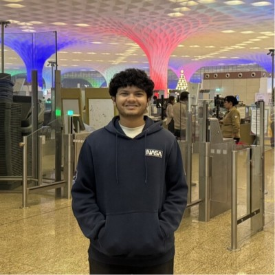

<!--
  ╔══════════════════════════════════════════════════════════════╗
  ║   Soham Margaj — GitHub Profile README                         ║
  ║   Theme: Tokyo Night (dark + neon)                             ║
  ║   Tip: keep this file in a repo named  soham555-maker          ║
  ╚══════════════════════════════════════════════════════════════╝
-->

<!-- ===================== TYPING BANNER ===================== -->

<!-- ===================== INTRO ===================== -->
<table>
  <tr>
    <td width="62%" valign="top">

### `> whoami`

Hey, I'm **Soham Sunil Margaj** — an Information Technology undergrad at **VJTI, Mumbai**, who lives at the intersection of **competitive programming** and **AI engineering**.

- 🧩 **ICPC Regionalist** — qualified for **Amritapuri** & **Kanpur** regionals (All-India Rank **426**)
- ⚡ **Specialist** on Codeforces · **3★** on CodeChef · **334+** solved on LeetCode
- 🤖 Building **RAG pipelines & agentic AI** with LangChain, FAISS, Groq & LLaMA
- 🌱 Currently exploring **Agentic AI and its cloud deployment**
- 🏆 Winner — *TechExtreme Tidal Transfer* · Top-10 — *Technovate 2.0 Hackathon*

    </td>
    <td width="38%" valign="top" align="center">
      
    </td>
  </tr>
</table>

<!-- ===================== SOCIALS ===================== -->

---

<!-- ===================== TECH STACK ===================== -->
## 🛠️ Tech Stack

**Languages**

**AI / ML**

**Frameworks & Web**

**Databases & Tools**

---

<!-- ===================== GITHUB STATS ===================== -->
## 📊 GitHub Stats

---

<!-- ===================== COMPETITIVE PROGRAMMING ===================== -->
## ⚔️ Competitive Programming

| Platform | Handle | Rating / Progress |
|:--------:|:------:|:-----------------:|
| ⚡ **Codeforces** | [sohammargaj55555](https://codeforces.com/profile/sohammargaj55555) | **Specialist** |
| 🍳 **CodeChef** | [sohammargaj526](https://www.codechef.com/users/sohammargaj526) | **3★** |
| 🟧 **LeetCode** | [Soham_Margaj](https://leetcode.com/u/Soham_Margaj/) | **334+ solved** |

---

<!-- ===================== FEATURED PROJECTS ===================== -->
## 🚀 Featured Projects

 

- 🤖 **[ResearchOS](https://github.com/soham555-maker/ResearchOS)** — AI-powered research assistant that automates literature review with a **zero-hallucination** ensemble retriever (FAISS + MMR + BM25), powered by Groq & LLaMA-3.1-8B. `Next.js · LangChain · Flask · Supabase`
- 📉 **[Customer Churn Prediction](https://github.com/soham555-maker/customer-churn-prediction-ml)** — End-to-end ML pipeline on 7,043 samples with SMOTE balancing; benchmarked Decision Tree, Random Forest, XGBoost & ANN. `Python · scikit-learn · XGBoost · TensorFlow`
- 🏫 **[PathshalaDB](https://github.com/soham555-maker/pathshala_DBS)** — Mobile app that dynamically finds empty classrooms with role-based access for teachers & students. `React Native · Flask · SQL · Supabase`

---

<!-- ===================== ACHIEVEMENTS ===================== -->
## 🏆 Achievements

- 🥇 **ICPC 2025** — Regionalist at **Amritapuri** (Rank 124/310) & **Kanpur** (Rank 84/110); All-India Rank **426** (Rank-2 team from college)
- 🏅 **TechExtreme — Tidal Transfer** — **🥇 1st Place** in a team-based competitive coding relay
- 🚀 **Technovate 2.0 Hackathon** — **Top-10 Finalist** @ SPIT (backend & system integration)
- 🧮 **Competitive Programming Club, VJTI** — Ranked **6th** among 150+ students in entrance exam

---

<!-- ===================== CURRENTLY LEARNING ===================== -->
## 🌱 Currently Learning

> **Agentic AI & Cloud Deployment** — diving deep into multi-agent orchestration, tool-using LLM agents, and shipping them to the cloud. Think autonomous agents that *plan, act, and deploy* themselves. 🤖☁️

---

<!-- ===================== TROPHIES ===================== -->
## 🎯 Trophy Case

---

<!-- ===================== SNAKE ===================== -->

  

⭐️ Thanks for visiting — let's build something great together!

